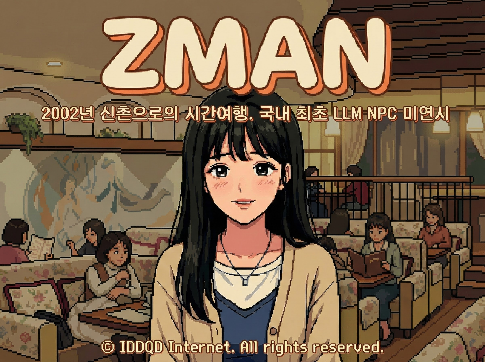

# ZMAN (젯뜨맨)

[Read in English](./README.md)

**ZMAN**은 2002년 신촌을 배경으로 한 **국내 최초 LLM(거대 언어 모델) 기반 NPC 미연시**입니다. 정해진 선택지를 고르는 것이 아니라, AI 히로인과 자유롭게 채팅하며 2000년대 초반의 추억과 감성에 젖어볼 수 있는 레트로 어드벤처 게임입니다.

# Our Philosophy
IDDQD Internet은 별도의 DB나 회원가입 없이, 순수 HTML/JS만으로 브라우저에서 즉시 실행되는 도구를 개발합니다. AI 기능을 제공할 때도 데이터 상태를 유지하지 않으며(stateless), 어떠한 기록도 남기지 않는 원칙을 고수합니다.

### [ZMAN 플레이하기](https://game.iddqd.kr/zman_tmp)

## Features
- **자유로운 AI 채팅**: 구글 Gemini 2.5 Flash 모델을 탑재하여, 사용자가 무슨 말을 하든 문맥에 맞는 자연스러운 답변과 리액션을 제공합니다.
- **2002년 레트로 감성**: 민들레영토, 캔모아, 홍익문고 등 그 시절 신촌의 핫플레이스와 소품들을 완벽하게 재현했습니다.
- **실시간 호감도 시스템**: 당신의 대화 스킬에 따라(AI의 판단에 따라) 호감도가 실시간으로 변동합니다. 호감도가 바닥나면 그녀는 떠나버립니다.
- **Stateless 구조**: 서버에 대화 내용을 일절 저장하지 않습니다. 브라우저를 닫으면 모든 기억은 사라지는 휘발성 연애입니다.

## 등장인물 (Heroines)

| 캐릭터 | 난이도 | 특징 |
|:---:|:---:|:---|
| **이서현** | ★★ | **"일탈을 꿈꾸는 모범생"** 캔모아 그네 의자에 앉아있는, 왠지 호기심 가득한 눈빛의 여대생. |
| **김지은** | ★★★ | **"사연 있는 문학소녀"** 민들레영토에서 누군가를 그리워하며 슬픈 표정을 짓고 있는 그녀. |
| **윤채림** | ★★★★ | **"압구정 날라리"** 홍익문고 앞에서 친구를 기다리는, 솔직하고 도도한 매력의 소유자. |

## Tech Stack
- **Frontend**: HTML5, CSS3, JavaScript (jQuery), Bootstrap 5
- **Backend**: PHP (Gemini API 키 보호를 위한 단순 프록시 역할)
- **AI Engine**: Google Gemini 2.5 Flash (Streaming 지원)
- **Storage**: LocalStorage (로컬 브라우저 저장)

## Disclaimer
- 본 게임은 픽션이며, 등장인물과 배경은 2002년 시대를 재현한 설정입니다.
- AI가 생성하는 답변은 예측 불가능할 수 있으며, 개발자의 의도와 다를 수 있습니다.

# Contact & Author
박실장
- IDDQD 인터넷 e-솔루션 및 e-게임 사업부 개발실장
- 기습코딩꾼 & 최상무의 모사꾼
- 홈페이지: https://iddqd.kr/
- 깃허브: https://github.com/iddqd-park
